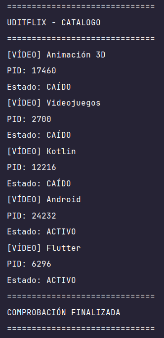

# Reto 1 · Monitor del catálogo de UDITflix

**Módulo:** 0490 · Programación de Servicios y Procesos
**Autor/a:** *David Fraile García*
**Reto:** Reto A (vídeos)
**Tecnología:** Java + `ProcessBuilder` (procesos del sistema operativo)
**RA vinculado:** RA1 · Programación de aplicaciones compuestas por varios procesos
---

## 📺 Qué es esta app

Un programa de consola que simula el monitor interno de UDITflix: comprueba si cada elemento del catálogo (vídeos o contenidos) está **ACTIVO** o **CAÍDO**. Para cada uno lanza un proceso externo (`ping`), muestra su PID, lee lo que responde y espera a que termine.



---

## 🧠 Antes de empezar: planifico (5 min, sin tocar el teclado)

Responde **antes** de escribir una sola línea de código. No importa si te equivocas: lo importante es dejar escrito qué pensabas.

1. **Con mis palabras, ¿qué me pide el reto?** *(sin copiar el enunciado)*
   *Crear una aplicación de consola en Java que verifique el estado de 5 vídeos simulando conexiones de red. Si la dirección IP de comprobación responde, el vídeo se considera activo; si la dirección no existe o falla, se considera caído. Todo esto gestionando procesos del sistema de forma automática.*

2. **¿Qué parte de la píldora de clase creo que voy a reutilizar?**
   *La configuración del ProcessBuilder para ejecutar comandos nativos, la captura del flujo de salida con BufferedReader, y el uso de waitFor() para pausar mi programa hasta que el subproceso termine de ejecutarse.*

3. **¿Qué parte me da más respeto o no sé por dónde empezar?**
   *Me impone un poco la gestión del bucle integrando la creación de los procesos. Capturar bien si el ping ha fallado dependiendo del código de salida (exit value) sin que el programa se quede bloqueado permanentemente esperando una IP falsa.*

4. **Mi plan en 3-4 pasos, en orden:**
   *1. Crear y rellenar la matriz bidimensional (String[][]) con los cinco nombres (Animación 3D, Videojuegos, Kotlin, Android, Flutter) y sus respectivas IPs (usando 127.0.0.1 para simular activos y direcciones falsas para simulaciones caídas).
   2. Montar el bucle for para iterar por cada elemento de la matriz.
   3. Dentro del bucle, instanciar un ProcessBuilder con el comando ping dirigido a la IP de turno, lanzarlo con start() y guardar su PID.
   4. Consumir la salida con getInputStream(), utilizar waitFor() para obtener el código final y, usando un condicional if, imprimir en consola el estado ACTIVO o CAÍDO y su PID correspondiente.*

6. **Predicción:** si todas las direcciones fueran `127.0.0.1`, ¿qué estado saldría en los cinco elementos? ¿Y si todas fueran direcciones inexistentes?
   *Si todas las direcciones fueran `127.0.0.1`, saldría "ACTIVO". Sin embargo, si fuesen direcciones inexistentes, saldría "CAÍDO" *

---

## 🎯 Objetivo del reto

Partir de lo aprendido en la píldora (lanzar **un** proceso) y dar el salto a **gestionar varios procesos con una estructura de datos y un bucle**, aplicando: creación de procesos con `ProcessBuilder`, identificación por PID, lectura de su salida, espera con `waitFor()` e interpretación de su resultado.

---

## 🛠️ Componentes y conceptos utilizados

Rellena la columna "con mis palabras" **sin mirar tus apuntes**. Después compara con ellos y corrige en otro color o con un comentario. Esa diferencia es exactamente lo que aún no tienes del todo claro.

| Componente / concepto | Para qué se usa en esta app | Con mis palabras |
|---|---|---|
| `ProcessBuilder` | Prepara la orden (`ping ...`) que se enviará al sistema operativo | Configura el comando exacto y sus parámetros antes de que Java le pida al SO que lo ejecute. |
| `start()` | Lanza de verdad el proceso; devuelve un `Process` sin esperarle | Inicia la ejecución del comando en segundo plano, permitiendo al código Java seguir adelante de forma inmediata. |
| `Process` | Objeto con el que controlo el proceso que ya está en marcha | Es mi "mando a distancia" para interactuar con el comando en ejecución (obtener información, leer salidas, etc.). |
| `pid()` | Número que identifica al proceso en el sistema operativo | Es como el DNI del proceso. Un identificador único que le asigna el SO mientras está vivo. |
| `getInputStream()` | Canal por el que **recibo** lo que escribe el proceso | El "tubo" de conexión que me permite recoger en Java todo el texto que el subproceso está escribiendo en su propia consola. |
| `BufferedReader` + `readLine()` | Leer esa salida línea a línea | Herramientas para leer el flujo de datos de getInputStream() de manera cómoda, en formato texto procesable por líneas. |
| `waitFor()` | Bloquea mi programa hasta que el proceso termina y devuelve su código de salida | Pone en pausa la ejecución del bucle Java hasta que el ping termina completamente su tarea, devolviendo si acabó bien (0) o con error (1). |
| Matriz `String[][]` | Guarda, para cada elemento, su nombre y su dirección de comprobación | Una estructura tabular donde cada fila representa un vídeo y sus columnas la información necesaria para procesarlo. |
| Bucle `for` | Repite el mismo proceso de comprobación para cada fila de la matriz | Un ciclo que evita copiar y pegar el código cinco veces, automatizando la comprobación de principio a fin. |

**¿Qué contiene cada posición de mi matriz?**

```
matriz[i][0] →  El nombre del vídeo en esa iteración
matriz[i][1] →  La dirección de comprobación
```

---

## 🚀 Cómo ejecutar el proyecto

1. Clonar o abrir el proyecto en IntelliJ IDEA.
2. Esperar a que indexe el proyecto.
3. Ejecutar (▶) la clase principal.

> ⚠️ El comando `ping` usa `-n` en Windows y `-c` en Linux/Mac para el número de intentos. Indica aquí con qué sistema lo has probado: *Lo he probado en Windows, por lo que en el ProcessBuilder he utilizado el argumento -n seguido de 1 para enviar un único paquete y que el proceso no se quede en un bucle infinito.*

---

## 🔍 Mientras programo: mi diario de decisiones

Cada vez que **te atasques, cambies de idea o algo falle**, anota una entrada. Tres líneas bastan. No se trata de quedar bien: se trata de que dentro de un mes puedas reconstruir cómo pensaste.

| Qué intentaba | Qué pasó realmente | Qué hice / qué aprendí |
|---|---|---|
| Comprobar el estado leyendo la palabra "Inaccesible" con el BufferedReader. | A veces el texto cambiaba de idioma según la consola o no se capturaba a tiempo. | Aprendí que es mucho más seguro usar el valor entero que devuelve waitFor(). Devuelve 0 si hubo éxito y otro valor si falló la conexión. |
| Ejecutar el ping pasándole los argumentos en un solo String ping 127.0.0.1. | Java arrojaba un error de que el archivo ejecutable no se encontraba. | Dividí el comando en diferentes posiciones del ProcessBuilder (ej: "ping", "-n", "1", ip), lo cual es obligatorio para que los espacios se interpreten bien. |
| Que el bucle comprobara los vídeos rápido. | Las IPs falsas hacían que el programa se quedara bloqueado durante varios segundos antes de avanzar al siguiente. | Entendí que la red tiene "timeouts". El proceso ping tarda en declarar una IP como caída y, al usar waitFor(), obligatoriamente me toca esperar ese tiempo. |

**Mi pregunta-brújula cuando me bloqueo:**
1. ¿Qué espero que haga esta línea?
2. ¿Qué está haciendo realmente? (imprimo valores para comprobarlo)
3. ¿En qué punto exacto se separan las dos respuestas?

---

## 🧭 De la píldora al reto: cómo di el salto

La píldora lanzaba **un** proceso. El reto lanza **cinco**. Explica ese salto con tus palabras:

- **¿Qué tenía la píldora que ya no me sirve tal cual?**
  *El comando del proceso y los textos que se imprimían en consola estaban fijos. Si quisiera lanzar 5, la píldora me obligaría a repetir el mismo bloque de código 5 veces consecutivas.*

- **¿Qué he tenido que añadir para repetirlo cinco veces? ¿Por qué esa estructura y no otra?**
  *He añadido una matriz de tipo String[][] y un bucle for. Esta estructura agrupa datos lógicamente emparejados (nombre del vídeo y su IP) y el bucle me permite reciclar la lógica de lanzamiento de procesos, aplicando solo las variables de cada iteración.*

- **¿Qué parte del código es exactamente igual en todas las vueltas del bucle y qué parte cambia?**
  *Es igual la instanciación de ProcessBuilder, así como la lectura y el waitFor(). Lo único que cambia en cada vuelta son los datos que le pasamos: el nombre a imprimir (matriz[i][0]) y la IP inyectada al comando de consola (matriz[i][1]).*

- **Si mañana UDITflix tuviera 500 elementos en lugar de 5, ¿qué tendría que cambiar en mi código?**
  *Únicamente la inicialización de los datos. En lugar de meter 5 filas tendría que meter 500*

---

## 🧠 Qué he aprendido

*(Completar al terminar. Redacta con tus palabras, no con las del enunciado.)*

- **Hilo vs. proceso:** la diferencia entre ambos es que el hilo es un flujo de ejecución ligero que comparte memoria dentro de nuestra propia aplicación Java, mientras que un proceso (como el que lanzamos) es un programa totalmente independiente con su propia memoria y recursos, administrado de forma externa por el sistema operativo.
- **PID:** lo que representa y por qué cambia en cada ejecución es 
- **`start()` vs. `waitFor()`:** lanzar un proceso y esperarle son cosas distintas porque start() solo da la orden de arrancar sin interrumpir a nuestro programa Java. En cambio, waitFor() obliga a nuestro programa Java a bloquearse deteniendo el bucle hasta que ese subproceso en concreto avisa que ha terminado.
- **Código de salida:** lo que significa que sea `0` o distinto de `0` es que el comando nativo (ping) informa al sistema operativo del resultado de su operación. Un 0 denota una ejecución exitosa (el vídeo conectó), y cualquier valor distinto (ej. 1) señala que hubo un error (el vídeo está caído).
- **Lo que mi programa decide sobre ACTIVO / CAÍDO se basa en...** *(¿es fiable? ¿en qué casos podría equivocarse?)* Es fiable a nivel de conectividad de red, pero podría equivocarse en el mundo real si la IP responde al ping pero el servidor web o el servicio de video interno está bloqueado o dañado.

---

## 🐞 Dificultades y cómo las resolví

*(Completar antes de entregar. Reúne lo más importante de tu diario de decisiones.)*

- **Dificultad 1:**
  - Qué síntoma vi: Al poner el BufferedReader y probarlo, por la consola de IntelliJ me salía impreso todo el texto de estadísticas del comando ping, lo cual ensuciaba el formato y no lo pedía el enunciado.
  - Cuál era la causa real: Estaba metiendo la lectura del readLine() dentro de un System.out.println() en el bucle, imprimiendo el output crudo del sistema operativo en lugar de centrarme solo en el resultado final.
  - Cómo la encontré: Comparando la consola de mi programa con la captura de "Resultado esperado" del PDF, donde solo aparecían el nombre, PID y estado.
  - Cómo evitaré que me vuelva a pasar: Teniendo claro que capturar la salida de un proceso con BufferedReader (para vaciar su buffer y evitar bloqueos) no significa que tenga la obligación de imprimir todo ese texto por pantalla al usuario final.

---

## 🪞 Autoevaluación

Marca con honestidad, no con optimismo. Nadie te califica esta sección: es para ti y para que el profesor sepa dónde ayudarte.

| Puedo explicar a un compañero... | 🔴 No | 🟡 Más o menos | 🟢 Sí |
|---|:-:|:-:|:-:|
| Qué hace `ProcessBuilder` | ☐ | ☐ | X |
| Qué hace `start()` y por qué no espera | ☐ | ☐ | X |
| Qué representa el PID | ☐ | ☐ | X |
| Para qué sirve `getInputStream()` | ☐ | X | ☐ |
| Qué hace `waitFor()` y qué devuelve | ☐ | ☐ | X |
| Qué hay en cada posición de la matriz | ☐ | ☐ | X |
| Qué hace el `for` en mi programa | ☐ | ☐ | X |

**Mi predicción del principio, ¿acerté?** *Sí, acerté. Usar la IP local 127.0.0.1 devuelve un código de éxito asegurado simulando un estado ACTIVO, mientras que usar IP sin enrutar provoca un error nativo del comando ping, lo que me permite capturarlo como CAÍDO.*

**Lo que haría diferente si empezara de nuevo:**
*Configuraría primero el comando ping de forma robusta e imprimiría solo los valores nativos para observar cómo se comporta en los casos exitosos y fallidos antes de montar la estructura de matrices y el bucle.*

**Lo que todavía no tengo claro y quiero preguntar en clase:**

---

## 🤝 Declaración de autoría

Este reto no permite herramientas de generación de código mediante IA. Consulté únicamente: la píldora de clase, mis apuntes, la documentación de Java e IntelliJ IDEA.

Confirmo que el código es mío y que puedo explicarlo línea a línea.

---

## 📂 Estructura del proyecto

```
src/main/java/org/example/   → clase con el main (el monitor de UDITflix)
README.md                    → este documento
```

*(Ajusta la estructura a la de tu proyecto.)*

## 🔗 Enlace

- GitHub: *[(tu repositorio)](https://github.com/davidfg02/psp-udit/tree/main/reto01-monitor-udiflix)*
