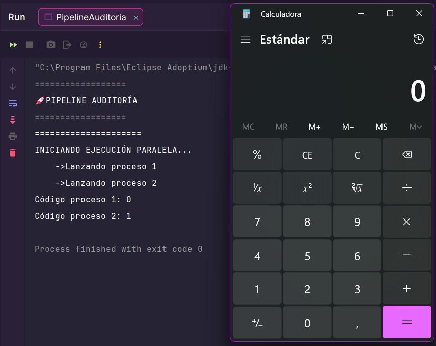

# Reto 2 · Pipeline de Auditoría UDITversum (Fase 1)

**Módulo:** 0490 · Programación de Servicios y Procesos
**Autor/a:** *David Fraile García*
**Tecnología:** Java + `ProcessBuilder` (procesos del sistema operativo)
**RA vinculado:** RA1 · Programación de aplicaciones compuestas por varios procesos

---

## 📺 Qué es esta app

Un programa de consola que simula la **primera fase de una auditoría de UDITversum**. El programa:

1. Lanza **dos comprobaciones (`ping`) a la vez**, cada una en su propio proceso del sistema operativo.
2. **Espera** a que ambas terminen.
3. Lee el **código de salida** de cada una.
4. Según el resultado combinado, **toma una decisión** y abre una aplicación del sistema (Bloc de Notas o Calculadora).

```
        ┌──────────────┐
        │  Mi programa │
        │   (Java)     │
        └──────┬───────┘
               │ start()          start()
        ┌──────┴──────┐    ┌──────┴──────┐
        ▼                         ▼
  ┌───────────┐             ┌───────────┐
  │  ping 1   │             │  ping 2   │   ← corren a la vez
  └─────┬─────┘             └─────┬─────┘
        │ waitFor()               │ waitFor()
        └───────────┬─────────────┘
                    ▼
          ¿códigos de salida?
                    │
        ┌───────────┴───────────┐
        ▼                       ▼
   Bloc de Notas           Calculadora
```




---

## 🧠 Antes de empezar: planifico *(5 min, sin tocar el teclado)*

Responde **antes** de escribir una sola línea de código. No importa si te equivocas: lo importante es dejar escrito qué pensabas.

**Con mis palabras, ¿qué me pide el reto?** *(sin copiar el enunciado)*
*El reto me pide iniciar dos procesos paralelos y en base a su código, abrir la calculadora o el notepad*

**¿Qué parte del Reto 1 voy a reutilizar tal cual?**
*Del reto 1, voy a usar la creación de procesos con ProcessBuilder y el condicional if*

**¿Qué es nuevo respecto al Reto 1 y me da más respeto?**
*Los procesos paralelos y abrir aplicaciones según el resultado*

**Mi plan en 4-5 pasos, en orden:**
1. *Lanzar los dos procesos*
2. *Usar waitFor() después de lanzar los dos procesos*
3. *Guardar en código de salida en una variable*
4. *Hacer un condicional que compruebe el resultado y abra aplicaciones con otro proceso*

**Predicciones** *(comprueba al final si acertaste)*

| Escenario | ¿Qué código de salida espero en cada ping? | ¿Qué aplicación se abre? |
|---|---|---|
| Los dos pings a `127.0.0.1` | *Proceso 1: 0 Proceso 2: 0* | *notepad* |
| Un ping válido y otro a una dirección inexistente | *Proceso 1: 0 Proceso 2: 1* | *calculadora* |
| Los dos pings a direcciones inexistentes | *Proceso 1: 1 Proceso 2: 1* | *calculadora* |

**Predicción de tiempo:** si cada ping tarda unos 3 segundos, ¿cuánto tardará mi programa en total si los lanzo en paralelo? ¿Y si los lanzara uno detrás de otro?

*Si los lanzo el paralelo, tardaría 3s. Si los lanzara secuencialmente, tardarían 6s (3 x n procesos)*

---

## 🎯 Objetivo del reto

Dar el salto de **gestionar un proceso tras otro** (Reto 1) a **coordinar varios procesos simultáneos**, aplicando:

- Creación de procesos con `ProcessBuilder` y `start()`.
- **Ejecución concurrente:** lanzar ambos procesos antes de esperar a ninguno.
- Sincronización con `waitFor()` y lectura del **código de salida**.
- **Lógica condicional** (`if` con `&&` / `||`) para decidir en función de varios resultados.
- Gestión de errores con `try/catch` (`IOException`, `InterruptedException`).

---

## 🛠️ Componentes y conceptos utilizados

> Rellena la columna **"con mis palabras"** *sin mirar tus apuntes*. Después compara con ellos y corrige en otro color o con un comentario. Esa diferencia es exactamente lo que aún no tienes del todo claro.

| Componente / concepto | Para qué se usa en esta app | Con mis palabras |
|---|---|---|
| `ProcessBuilder` | Prepara la orden que se enviará al sistema operativo (ping, notepad, calc) | Define el comando a ejecutar |
| `start()` | Lanza de verdad el proceso y **devuelve el control enseguida**, sin esperar | Se encarga de lanzar el proceso |
| `Process` | Objeto con el que controlo cada proceso ya en marcha | |
| `waitFor()` | Bloquea mi programa hasta que ese proceso termina y devuelve su código de salida |  Espera hasta que el proceso termina |
| Código de salida (`int`) | Dice cómo terminó el proceso: `0` = éxito, distinto de `0` = fallo | |
| `&&` (AND) | Se cumple solo si **las dos** condiciones son verdaderas | Es un operador lógico que se cumple unicamente si las dos opciones son verdaderas |
| `\|\|` (OR) | Se cumple si **al menos una** condición es verdadera | Es un operador lógico que se cumple si al menos una opción es verdadera |
| `try/catch` | Captura errores que Java no puede evitar (el SO no encuentra el programa, etc.) | Se encarga de capturar errores que no saltarían en un caso normal y evita que el programa continúe |
| `InterruptedException` | Excepción que obliga a gestionar `waitFor()` por si el hilo es interrumpido |  Excepción que salta en caso de que el proceso sea interrumpido |

**¿Cómo se llaman mis dos objetos `Process` y qué lanza cada uno?**
*Se llaman p1 y p2. El p1 intenta hacer ping a localhost y el p2 hace ping a un servidor inválido *

---

## 🔀 Secuencial vs paralelo: el corazón de este reto

Lo que separa un buen Reto 2 de uno que "funciona pero no cumple" es **dónde pones los `waitFor()`**. Compara las dos líneas de tiempo (suponiendo que cada ping tarda 3 s):

**❌ Secuencial** (`waitFor()` antes del segundo `start()`):

```
t=0s   start(ping A) ──────────── waitFor() ── termina en t=3s
t=3s                              start(ping B) ──────────── waitFor() ── termina en t=6s
                                                                          TOTAL ≈ 6 s
```

**✅ Paralelo** (los dos `start()` primero, los `waitFor()` después):

```
t=0s   start(ping A) ─┐
t=0s   start(ping B) ─┤  los dos procesos corren a la vez
t=3s   waitFor(A) ✔  waitFor(B) ✔
                                  TOTAL ≈ 3 s
```

**Mi orden real de llamadas, copiado de mi código** *(pega solo las líneas relevantes)*:

```java
System.out.println("    ->Lanzando proceso 1");
            Process p1 = new ProcessBuilder("ping", "-n", "2", "127.0.0.1").start();
            System.out.println("    ->Lanzando proceso 2");
            Process p2 = new ProcessBuilder("ping", "-n", "2", "error.invalid").start();

            int codigo1 = p1.waitFor();
            int codigo2 = p2.waitFor()
```

---

## 🔢 Tabla de verdad de mi decisión

Completa con **tu** lógica real (la del enunciado):

| Código ping A | Código ping B | ¿Ping A OK? | ¿Ping B OK? | Condición (`&&` / `\|\|`) | Aplicación que abro |
|---|---|---|---|---|---|
| 0 | 0 | SÍ | SÍ | && | notepad |
| 0 | ≠ 0 | SÍ | No | && | calculadora |
| ≠ 0 | 0 | No | SÍ | && | calculadora |
| ≠ 0 | ≠ 0 | No | No | && | calculadora |

**¿Cambiaría el resultado de alguna fila si cambiara `&&` por `||`? ¿En cuáles?**
*Sí, la fila 2 y 3 cambiarían*

---

## 🚀 Cómo ejecutar el proyecto

1. Clonar o abrir el proyecto en IntelliJ IDEA.
2. Esperar a que indexe el proyecto.
3. Ejecutar (▶) la clase principal.

⚠️ **Dependencia del sistema operativo:** `ping` usa `-n` en Windows y `-c` en Linux/Mac, y `notepad.exe` / `calc.exe` solo existen en Windows. Indica con qué sistema lo has probado: *Windows*

---

## 🔍 Mientras programo: mi diario de decisiones

Cada vez que te atasques, cambies de idea o algo falle, anota una entrada. Tres líneas bastan. No se trata de quedar bien: se trata de que dentro de un mes puedas reconstruir **cómo pensaste**.

| Qué intentaba | Qué pasó realmente | Qué hice / qué aprendí |
|---|---|---|
| *(ejemplo)* Que los dos pings corrieran a la vez | El programa tardaba el doble de lo esperado | Me di cuenta de que había puesto un `waitFor()` entre los dos `start()` y... |
| Abrir notepad/calculadora | El programa no reaccionaba| Aprendí que tenía que lanzar otros dos nuevos procesos dentro del condicional |
| | | |
| | | |

**Mi pregunta-brújula cuando me bloqueo:**
1. ¿Qué espero que haga esta línea?
2. ¿Qué está haciendo realmente? *(imprimo valores para comprobarlo)*
3. ¿En qué punto exacto se separan las dos respuestas?

---

## 🧠 Análisis técnico (preparación para la defensa)

> Responde de forma clara y **con tus propias palabras**. Estas preguntas serán la base de tu evaluación oral. Las pistas en cursiva son para orientarte, no para copiarlas.

### 1. Secuencial vs paralelo

**¿Qué líneas exactas garantizan que los dos pings se ejecutan a la vez? ¿Qué ocurriría físicamente si pusieras el primer `waitFor()` justo antes de lanzar el segundo `start()`?**

```java
Process p1 = new ProcessBuilder("ping", "-n", "2", "127.0.0.1").start();
            System.out.println("    ->Lanzando proceso 2");
            Process p2 = new ProcessBuilder("ping", "-n", "2", "error.invalid").start();
            int codigo1 = p1.waitFor();
            int codigo2 = p2.waitFor();
```

*Si pusiera el waitFor() antes del segundo proceso, serían procesos secuenciales*

*Pistas: ¿qué hace `start()` con el hilo principal de mi programa? ¿Quién ejecuta el ping: mi programa o el sistema operativo? ¿Cuántos procesos existen en ese momento en cada caso? ¿Cuánto tardaría el programa completo?*

### 2. El código de salida (exit code)

**¿Qué tipo de dato devuelve `waitFor()`? ¿Qué significa en el estándar de los sistemas operativos que ese valor sea `0` o distinto de `0`?**

*waitFor() devuelve un int con el código de salida del proceso. Un 0 significa que el proceso terminó correctamente, y cualquier valor distinto de 0 indica que terminó con algún error.*

*Pistas: piensa en "0 = todo fue bien". ¿Por qué crees que el estándar eligió precisamente el 0 para el éxito y deja los demás números libres? ¿Qué información extra pueden aportar los valores distintos de 0? ¿Es lo mismo "el ping falló" que "el programa ping no pudo ejecutarse"?*

### 3. Lógica condicional

**Escribe aquí la condición `if` exacta que has programado. Explica por qué has utilizado `&&` o `||` para decidir si abrir el Bloc de Notas o la Calculadora.**

```java
if(codigo1 == 0 && codigo2 == 0){
                new ProcessBuilder("notepad.exe").start();
            } else{
                new ProcessBuilder("calc.exe").start();
            }
```

*Si ambos códigos son 0, el programa lanzará el notepad, en caso contrario, abrirá la calculadora*

*Pistas: ¿qué debe pasar para que se abra cada aplicación? Si usaras el operador contrario, ¿en qué fila de mi tabla de verdad cambiaría el resultado? ¿Qué pasaría si uno de los dos pings falla y el otro no?*

### 4. Gestión de excepciones

**Tu código incluye un bloque `try/catch`. Describe una situación real (un fallo del sistema o una mala configuración) que provocaría que tu programa entrase en el `catch` de `IOException`.**

*Si el sistema operativo no puede lanzar el programa que le pido, start() lanza una IOException y el programa entra en el catch. Si escribiera mal el nombre del comando, por ejemplo new ProcessBuilder("pingg", "-n", "2", "127.0.0.1").start(), el sistema no encontraría ningún ejecutable llamado pingg y fallaría al intentar lanzarlo.*

*Pistas: `IOException` salta cuando Java **no consigue ni arrancar** el proceso. ¿Qué pasaría si escribo mal el nombre del ejecutable (`notepd.exe`)? ¿Y si ejecuto en un sistema operativo donde ese programa no existe? ¿En qué se diferencia esto de que el ping "falle" y devuelva un código distinto de 0?*

---

## 🛡️ Preparación para la defensa: ¿sabría hacer esto en directo?

Durante la defensa te pediré pequeñas modificaciones. Practica estas **antes** de entregar y marca las que ya sabes hacer sin ayuda:

- ☐ Cambiar la condición para que se abra la Calculadora **solo si falla uno de los dos pings**.
- ☐ Añadir un **tercer ping** en paralelo y que la decisión dependa de los tres.
- ☐ Mostrar el **PID** de cada proceso al lanzarlo.
- ☐ Medir y mostrar **cuántos milisegundos** tarda en total el programa.
- ☐ Hacer que el programa funcione en **Linux** (cambiar `-n` por `-c` y las apps a abrir).
- ☐ Provocar a propósito una `IOException` y mostrar un mensaje claro al usuario.
- ☐ Explicar qué pasaría si quito el `waitFor()`.

**¿Cuál me costó más y por qué?**
*(escribe aquí)*

---

## 🧭 Del Reto 1 al Reto 2: cómo di el salto

El Reto 1 lanzaba procesos **uno tras otro** dentro de un bucle. El Reto 2 los lanza **a la vez**. Explica ese salto con tus palabras:

**¿Qué hacía mi Reto 1 que aquí ya no me sirve tal cual?**
*Mostrar el PID de los procesos*

**¿Qué he tenido que cambiar para que dos procesos corran simultáneamente?**
*Poner el waitFor() después de iniciar los procesos*

**¿Qué ventaja tiene lanzar en paralelo? ¿Y qué problema nuevo aparece cuando dependo de dos resultados a la vez?**
*Lanzar en paralelo permite que los procesos se ejecuten a la vez, con lo que se ahorra tiempo y el programa no se queda bloqueado esperando a cada uno. El problema nuevo es la sincronización: como cada proceso termina en un momento distinto, tengo que esperar a ambos con waitFor() y recoger los dos códigos de salida antes de decidir si el resultado conjunto es correcto.”*

**Si mañana el pipeline tuviera 50 comprobaciones en lugar de 2, ¿seguiría teniendo sentido mi estructura de código? ¿Qué cambiaría?**
*No, ya que tendría que crear los 50 procesos a mano y combinar 50 condiciones con &&. Un bucle en lugar de código repetido. Un primer for lanzaría todos los procesos con start().*

---

## 🧠 Qué he aprendido

> *(Completar al terminar. Redacta con tus palabras, no con las del enunciado.)*

- **`start()` vs `waitFor()`:** lanzar un proceso y esperarle son cosas distintas porque start() solo pone el programa en marcha, mientras que waitFor() bloquea mi programa hasta que ese proceso termina y me da su código de salida.
- **Paralelismo real:** dos procesos corren "a la vez" porque el waitFor() se declara tras iniciar ambos procesos
- **Código de salida:** que sea `0` o distinto de `0` significa que el proceso es correcto o ha tenido algún error
- **`&&` vs `||`:** elegí el operador que elegí porque comprueba que ambos sean 0, como pide el enunciado
- **`IOException` vs ping fallido:** la diferencia entre ambos es que la IOException salta cuando el sistema operativo no consigue lanzar el programa, en cambio, un ping fallido, significa que ping sí se ha lanzado bien, pero el host no existe
- **Fiabilidad de mi decisión:** lo que mi programa decide se basa únicamente en el código de salida de cada ping*

---

## 🐞 Dificultades y cómo las resolví

> *(Completar antes de entregar. Reúne lo más importante de tu diario de decisiones.)*

**Dificultad 1:**
- Qué síntoma vi: No lanzaba las aplicaciones
- Cuál era la causa real: No había iniciado dos nuevos procesos
- Cómo la encontré (¿apuntes? ¿documentación oficial? ¿depuración?): en los apuntes
- Cómo evitaré que me vuelva a pasar: siendo consciente de que al lanzar se necesitan iniciar procesos

**Dificultad 2:** *(opcional)*

---

## 🪞 Autoevaluación

Marca con honestidad, no con optimismo. Nadie te califica esta sección: es para ti y para que el profesor sepa dónde ayudarte.

| Puedo explicar a un compañero… | 🔴 No | 🟡 Más o menos | 🟢 Sí |
|---|:---:|:---:|:---:|
| Qué hace `ProcessBuilder` | ☐ | ☐ | X |
| Por qué `start()` no espera | ☐ | ☐ | X |
| Qué línea hace que mis procesos sean paralelos | ☐ | ☐ | X |
| Qué pasaría si moviera el `waitFor()` | ☐ | ☐ | X |
| Qué devuelve `waitFor()` y qué significa `0` | ☐ | ☐ | X |
| Por qué uso `&&` / `\|\|` en mi condición | ☐ | ☐ | X |
| Cuándo se entra en el `catch` de `IOException` | ☐ | ☐ | X |

**Mis predicciones del principio, ¿acerté?** *Sí*

**Lo que haría diferente si empezara de nuevo:**
*Empezaría probando cada proceso por separado antes de combinarlos, imprimiendo el código de salida de waitFor() desde el principio para ver qué devuelve cada uno*

**Lo que todavía no tengo claro y quiero preguntar en clase:**
*Tengo todo claro*

---

## 🤝 Declaración de autoría y aprendizaje

Este reto **no permite herramientas de IA generativa**. Consulté únicamente: los apuntes de clase, la documentación oficial de Java e IntelliJ IDEA.

X Confirmo que he diseñado, programado y depurado este código aplicando mi propio razonamiento, y que puedo explicarlo línea a línea.

X Entiendo que durante la defensa el profesor me pedirá realizar pequeñas modificaciones sobre este código para comprobar mi comprensión del multiproceso.

---

## 📂 Estructura del proyecto

```
src/main/java/org/example/   → clase con el main (el pipeline de auditoría)
README.md                    → este documento
img                          → contiene las capturas de salida  
```


## 🔗 Enlace

GitHub: *https://github.com/davidfg02/psp-udit/tree/main/reto02_pipeline-auditoria*